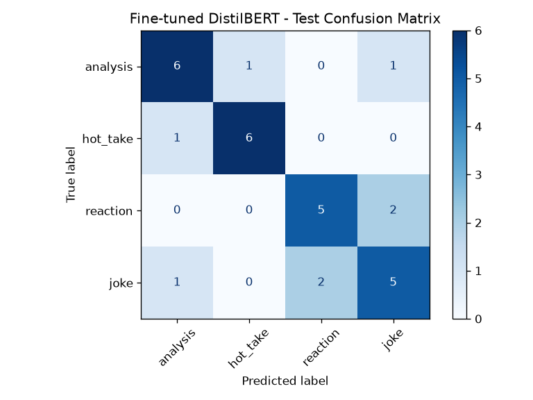

# TakeMeter — F1 Discourse Classifier

A fine-tuned DistilBERT model that classifies Formula 1 Reddit comments by register: `analysis`, `hot_take`, `reaction`, or `joke`.

> **Status:** in progress. Sections below are filled as the project advances (see [planning.md](planning.md) for the full design and [docs/superpowers/plans](docs/superpowers/plans) for the implementation plan).

## Community

<!-- 2-3 sentences: which community, why these distinctions matter. Reuse planning.md §1. -->

## Labels & definitions

<!-- The four labels, one-sentence definitions, and the decision rules. From planning.md §2-3. -->

## Data

### Source
<!-- Which subreddits/threads, that the unit is comments, collected via PRAW. -->

### Labeling process
<!-- How the decision rules were applied; single annotator. -->

### Label distribution
<!-- Actual counts per label (from the final dataset). -->

### Three hard-to-label examples
<!-- 3 real comments + which labels they could be + what you decided and why. -->

## Model & training

<!-- Started from distilbert-base-uncased; training approach; the epochs hyperparameter decision + rationale. -->

## Baseline (Groq zero-shot)

<!-- llama-3.3-70b-versatile, zero-shot, evaluated on the same test set. -->

## Evaluation report

### Metrics
<!-- Accuracy for BOTH models; per-class precision/recall/F1. -->

### Confusion matrix
<!--  -->

### Error analysis (3+ examples)
<!-- 3 specific wrong predictions + why. -->

### What the model learned vs. what I intended
<!-- Reflection; lead with the tone-vs-substance failure mode. -->

## How to run

<!-- venv + pip install, .env setup, collect.py, make_splits.py, Colab steps. -->
